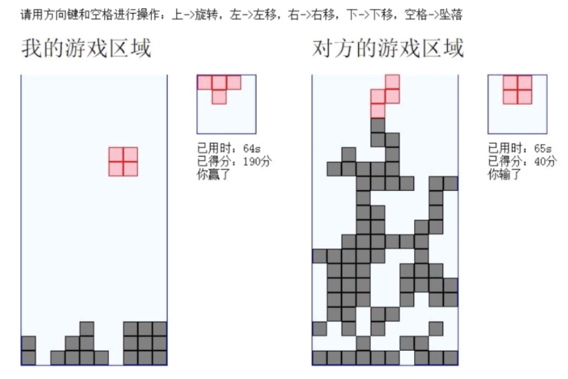

# 基于WebSocket的火拼俄罗斯方块
[慕课网-基于WebSocket火拼俄罗斯](https://www.imooc.com/learn/861)课程小游戏

实例效果图


## 必备知识
- HTML + CSS 基础
- JavaScript
- NodeJS

## WebSocket
- 官网：[http://www.websocket.org](http://www.websocket.org)
- HTML5
- Web端的socket，server和client可以相互发送消息
- 本质是TCP链接

## nodejs-websocket
github:[nodejs-websocket](https://github.com/sitegui/nodejs-websocket)
```
| npm install nodejs-websocket
```
用法
```javascript
var ws = require("nodejs-websocket")
// Scream server example: "hi" -> "HI!!!"
var server = ws.createServer(function (conn) {
	console.log("New connection")
	conn.on("text", function (str) {
		console.log("Received "+str)
		conn.sendText(str.toUpperCase()+"!!!")
	})
	conn.on("close", function (code, reason) {
		console.log("Connection closed")
	})
}).listen(8001)
```

## socket.io框架 
官网:[https://socket.io](https://socket.io)
```
| npm install socket.io
```
用法

1.服务器端  Server(app.js)
```javascript
var app = require('http').createServer(handler)
var io = require('socket.io')(app);
var fs = require('fs');
app.listen(80);

function handler (req, res) {
  fs.readFile(__dirname + '/index.html',
  function (err, data) {
    if (err) {
      res.writeHead(500);
      return res.end('Error loading index.html');
    }

    res.writeHead(200);
    res.end(data);
  });
}
io.on('connection', function (socket) {
  socket.emit('news', { hello: 'world' });
  socket.on('my other event', function (data) {
    console.log(data);
  });
});
```

2.客户端 Client(index.html)
```html
<script src="/socket.io/socket.io.js"></script>
<script>
  var socket = io('http://localhost');
  socket.on('news', function (data) {
    console.log(data);
    socket.emit('my other event', { my: 'data' });
  });
</script>
```

- 可以直接发送和接收js对象
- 可自定义消息

emit为发送，on为接收

### socket.emit
向socket所代表的客户端发送消息
### io.emit
进行广播

## WebSocket特点
- 允许浏览器和服务器建立持久连接
- HTML5的websoket API
- 服务器端使用ndoejs-websocket实现websocket server
- 使用socket.io实现websocket